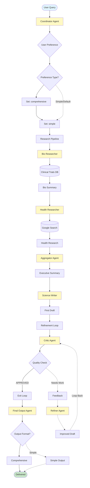

```mermaid
flowchart TB
    subgraph row1[" "]
        direction LR
        Start([User Query]) --> Coordinator[Coordinator Agent]
        Coordinator --> UserPrompt{User Preference}
        UserPrompt --> PrefCheck{Preference Type?}
        PrefCheck --> SetComp[Set: comprehensive]
    end
    
    subgraph row2[" "]
        direction LR
        SetSimple[Set: simple] --> ResearchPipe[Research Pipeline]
        ResearchPipe --> BioRes[Bio Researcher]
        BioRes --> BioSearch[(Clinical Trials DB)]
        BioSearch --> BioOut[Bio Summary]
    end
    
    subgraph row3[" "]
        direction LR
        HealthRes[Health Researcher] --> GoogleSearch[(Google Search)]
        GoogleSearch --> HealthOut[Health Research]
        HealthOut --> Aggregator[Aggregator Agent]
        Aggregator --> ExecSum[Executive Summary]
    end
    
    subgraph row4[" "]
        direction LR
        InitWriter[Science Writer] --> Draft1[First Draft]
        Draft1 --> RefineLoop[Refinement Loop]
        RefineLoop --> Critic[Critic Agent]
        Critic --> CriticCheck{Quality Check}
    end
    
    subgraph row5[" "]
        direction LR
        ExitLoop[Exit Loop] --> FinalAgent[Final Output Agent]
        FinalAgent --> FormatCheck{Output Format?}
        FormatCheck --> CompOutput[Comprehensive]
        CompOutput --> End([Delivered])
    end
    
    %% Cross-row connections
    SetComp --> SetSimple
    PrefCheck -.->|Simple/Default| SetSimple
    BioOut --> HealthRes
    ExecSum --> InitWriter
    CriticCheck -->|APPROVED| ExitLoop
    CriticCheck -.->|Needs Work| Feedback[Feedback]
    Feedback -.-> Refiner[Refiner Agent]
    Refiner -.-> ImprovedDraft[Improved Draft]
    ImprovedDraft -.->|Loop Back| Critic
    FormatCheck -.->|Simple| SimpleOutput[Simple Output]
    SimpleOutput -.-> End
    
    %% Styling
    style Start fill:#e1f5ff
    style End fill:#c8e6c9
    style Coordinator fill:#fff9c4
    style BioRes fill:#fff9c4
    style HealthRes fill:#fff9c4
    style Aggregator fill:#fff9c4
    style InitWriter fill:#fff9c4
    style Critic fill:#fff9c4
    style Refiner fill:#fff9c4
    style FinalAgent fill:#fff9c4
    
    %% Hide subgraph borders
    style row1 fill:none,stroke:none
    style row2 fill:none,stroke:none
    style row3 fill:none,stroke:none
    style row4 fill:none,stroke:none
    style row5 fill:none,stroke:none
```