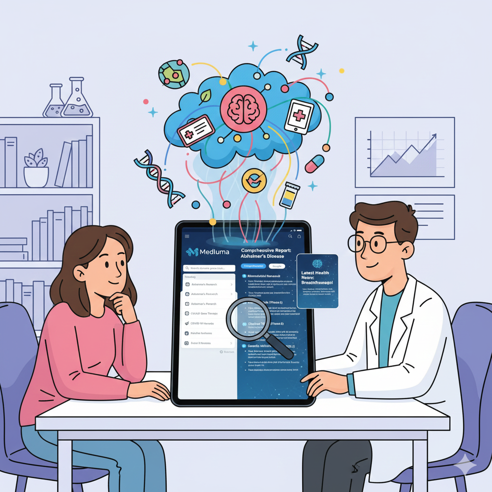

# 🏥 Medluma: The AI-Powered Disease Information Portal

### Bridging the gap between complex medical data and accessible health information.

**Track:** Agents for Good 🌍

-----

### 🚫 The Problem: The "Dr. Google" Dilemma

In an era of information overload, researching a medical condition is often overwhelming. Patients and their families are forced to navigate two unappealing extremes:

1.  **Dense Academic Data:** Jargon-heavy biomedical research papers (e.g., via PubMed) that are difficult for laypeople to interpret.
2.  **Alarmist Health News:** Unverified, clickbait articles or forum threads that induce anxiety rather than understanding.

There is a significant gap between raw medical data and accessible, actionable health intelligence. A simple LLM chat often hallucinates specific details, while traditional search engines provide lists of links, not synthesis.

### ✅ The Solution: Medluma

**Medluma** is a **Multi-Agent Orchestration Engine** designed to act as an intelligent medical research assistant. It doesn't just "search"; it actively researches, aggregates, synthesizes, and verifies information to produce high-quality disease reports.

By leveraging the **Google Agent Development Kit (ADK)** and **Gemini 2.0**, Medluma democratizes access to health information. It empowers users to choose their depth of understanding—from a "Simple" executive summary for a patient to a "Comprehensive" deep-dive including genetic mutations and clinical trials for students or researchers.

-----

## ⚙️ The Implementation

To build Medluma, I moved beyond simple prompting and architected a system that utilizes **three specific advanced agentic concepts** from the course:

### 1\. Multi-Agent System (Parallel & Sequential Architectures) 🤝

Medluma is a team of specialized agents working in concert to handle complex tasks efficiently:

  * **🎛️ The Coordinator:** Acts as the brain, parsing user intent and routing the workflow based on the chosen output complexity (Simple vs. Comprehensive).
  * **⚡ Parallel Researchers:** To maximize efficiency, two agents run in parallel to gather diverse data:
      * **🧬 Bio Researcher:** Dives into deep technical data via **Tools** (specifically, a mock **BioMCP** integration).
      * **📰 News Researcher:** Scans for real-time breakthroughs and media coverage using **Built-in Tools** (Google Search).
  * **✍️ The Writer/Synthesizer:** Sequentially combines and synthesizes the data streams.

### 2\. Tools & The Model Context Protocol (MCP) 🛠️

Accuracy in health information is critical, requiring verified external data.

  * **Custom Tool/MCP Integration:** The **Bio Researcher** agent is integrated with a simulated `BioMCP` (Model Context Protocol). This demonstrates the principle of using a specialized, structured data-access tool for deterministic fetching of clinical trial IDs, genetic markers, and verified research papers.
  * **Built-in Tools:** The **News Researcher** utilizes **Google Search** to fetch real-time developments that occurred after the model's knowledge cutoff.

### 3\. Loop Agents (Quality Assurance Cycles) 🔄

Medluma implements a **Critique-Refine Loop** to ensure the final output is high-quality and safe.

  * **The Critic Agent:** Reviews the Writer's initial draft against specific criteria (clarity, tone, factual consistency).
  * **The Refiner Agent:** Iteratively improves the draft based on the Critic's feedback, ensuring the final output is **curated**, not just generated. This loop is essential for preventing LLM hallucinations in a sensitive domain.

-----

## 🏗️ Architecture

The system follows a directed flow with a specific feedback loop for quality control.

### **Architecture Diagram**

  

*Complete workflow showing the multi-agent orchestration process*

1.  **User Query**
2.  **Orchestration**
3.  **Parallel Data Ingestion** (Bio Researcher + News Researcher)
4.  **Context Engineering:** An **Aggregator** step compacts the context before passing it to the Writer to manage the LLM's token window efficiently.
5.  **Synthesis**
6.  **Refinement Loop** (Critic & Refiner)
7.  **Final Delivery**

-----

### 🚀  Use of Gemini

The entire agent system is powered by **Gemini 2.0 Flash**, chosen for its speed and advanced reasoning capabilities in the orchestration and synthesis phases, earning points for the **Effective Use of Gemini** criteria.

-----

### Future Roadmap

  * **Mobile Application:** Porting the agentic backend to a Flutter frontend for on-the-go access.
      * **Instruction (Optional):** You can include the `future_app_medluna.jpg` image here to visually showcase the future vision.
  * **Personalized Alerts:** Utilizing **Sessions & Memory** with **Long-running operations** to allow an agent to "watch" for new clinical trials relevant to a user's disease and send personalized notifications.

-----

## 📹 Demo and Media Gallery

### **YouTube Video Submission**

   * **📹   Medluma Introductory Video:** https://youtu.be/5qgAy6sQZJU
  * **📹   Demo Video:** https://youtu.be/dw8fAooegd0

-----

## 🔗 Links & Resources

  * **💻 Code Repository:** https://github.com/capgalea?tab=repositories
  * **📄 Documentation:** See the `README.md` file in the repository for full setup and agent details.
 

-----